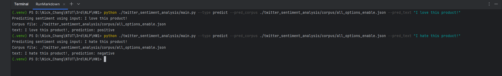
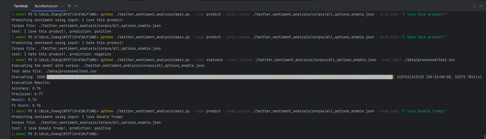

# Twitter Sentiment Analysis

This project aims to analyze sentiment on Twitter using natural language processing techniques and a Naive Bayes classifier to categorize tweets as positive or negative.

## Quick Start

**Follow these steps to get started quickly:**

1. Set up a virtual environment:
   ```bash
   python -m venv .venv
   source .venv/bin/activate  # On Windows, use .venv\Scripts\activate
   pip install -r requirements.txt
   ```

2. Fetch and preprocess data:
   ```bash
   python ./twitter_sentiment_analysis/main.py --type preprocess
   ```

3. Build a corpus from training data (It may take up to 3 minutes):
   ```bash
   python ./twitter_sentiment_analysis/main.py --type build --build_data ./data/processed/train.csv --build_out ./corpus/all_options_enable.json --build_lemmatize --build_remove stopwords,digits,special_characters,urls,handles,tags
   ```

4. Predict sentiment using a corpus:
   ```bash
   python ./twitter_sentiment_analysis/main.py --type predict --pred_corpus ./corpus/all_options_enable.json --pred_text "I love this product!"
   ```

5. Evaluate the corpus using a test dataset:
   ```bash
   python ./twitter_sentiment_analysis/main.py --type evaluate --eval_corpus ./corpus/all_options_enable.json --eval_data ./data/processed/test.csv
   ```

## Dataset

The dataset used in this project is sourced from [Hugging Face](https://huggingface.co/datasets/carblacac/twitter-sentiment-analysis). It contains labeled tweets for training and testing sentiment analysis models.

## Project Structure

```
.
├── screenshot/                  # Directory for screenshots
├── data/                        # Directory for datasets
├── corpus/                      # Directory for corpora
├── twitter_sentiment_analysis/
│   ├── main.py                  # Main script for command-line operations
│   ├── data/                    # Data utilities
│   └── corpus/                  # Corpus utilities
├── requirements.txt             # List of required Python packages
├── pyproject.toml
├── .gitignore
├── .gitattributes
└── README.md                    # Project documentation
```

## Requirements

- Python 3.10 or higher
- Virtual environment support (`venv`)
- Required Python packages:
  - pandas
  - nltk
  - tqdm
  - requests
- An internet connection is required to download the corpus during the build operation (not needed if using a pre-built corpus).

## Usage

The script supports four main operations: `preprocess`, `build`, `predict`, and `evaluate`. Below are the usage details:

### Preprocess Operation

Fetch and preprocess data:
```
python ./twitter_sentiment_analysis/main.py --type preprocess
```
- This operation downloads raw data from the specified source and processes it into a clean format.   
- The processed data is saved in the `./data/processed/` directory for further use.

### Build Operation

Build a corpus from training data:
```
python ./twitter_sentiment_analysis/main.py --type build --build_data <path_to_training_data> --build_out <path_to_output_corpus> [--build_lemmatize] [--build_remove <items_to_remove>]
```
- `--build_data`: Path to the training data file.
- `--build_out`: Path to save the built corpus.
- `--build_lemmatize`: Enable lemmatization (optional).
- `--build_remove`: Comma-separated list of items to remove (default: nothing to remove from corpus)

### Predict Operation

Predict sentiment for text or data using a pre-built corpus:
```
python ./twitter_sentiment_analysis/main.py --type predict --pred_corpus <path_to_corpus> (--pred_text <text> | --pred_data <path_to_data>)
```
- `--pred_corpus`: Path to the corpus file.
- `--pred_text`: Text input for prediction (optional).
- `--pred_data`: Path to the data file for prediction (optional).

### Evaluate Operation

Evaluate the model using test data:
```
python ./twitter_sentiment_analysis/main.py --type evaluate --eval_corpus <path_to_corpus> --eval_data <path_to_test_data>
```
- `--eval_corpus`: Path to the corpus file.
- `--eval_data`: Path to the test data file.


## Information

```
In this homework, we try to predict whether positive or negative the sentiment is.  
You can try to predict a sentence or evaluate a data.  
If you try to predict a sentence, the result well be positive or negative.  
If you try to evaluate a data, you will get Accuracy、Precision、Recall and F1 score.  
```

## Method

```
We try to calculate each words it's positive and negative counts.  
Total amount will be stored into `all_option_enable.json` ,which is in the `corpus` folder.  
When we predict a sentence, we would calculate by this `json` file using bayes classifier.  
```

## Screenshot

> This is the result for predicting a sentence.



> This is the result for executing a data.




## Team member 

- 111590002 鄭重雨 - 程式撰寫及文件撰寫 [50%]
- 111590004 張意昌 - 問題排除及文件撰寫 [50%]
