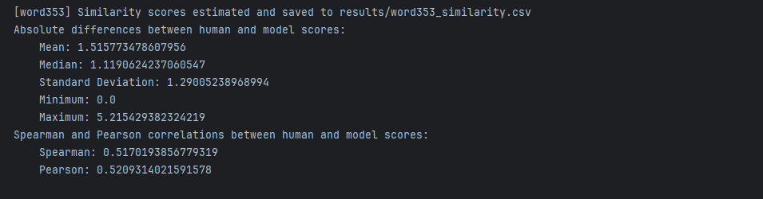
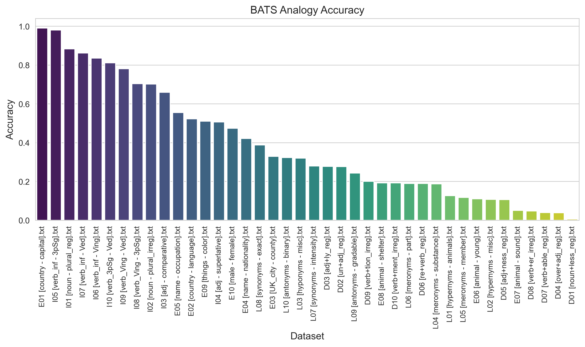
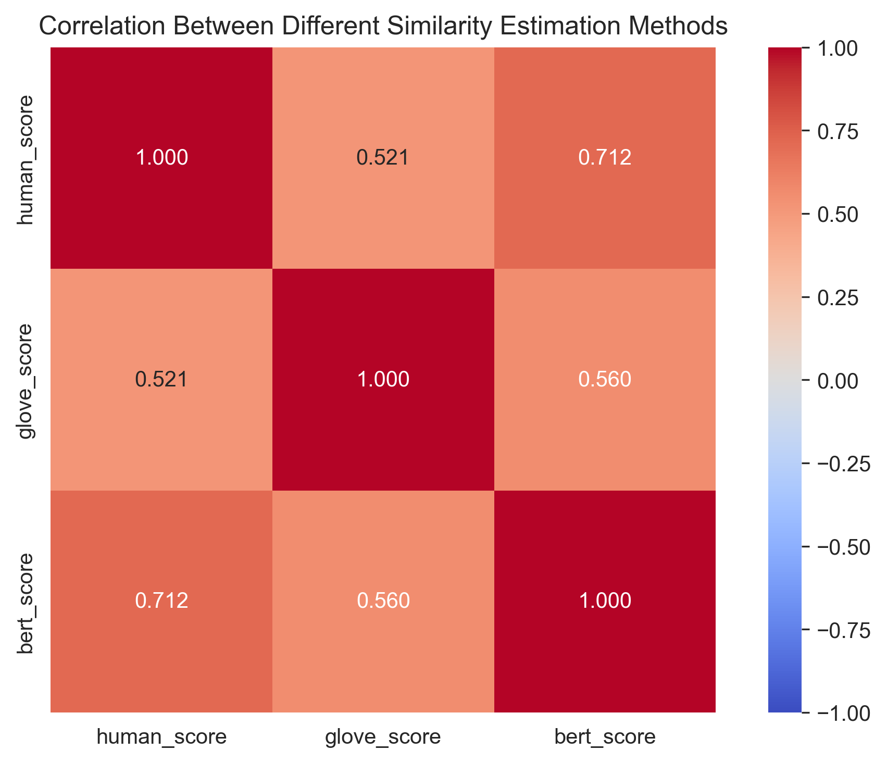
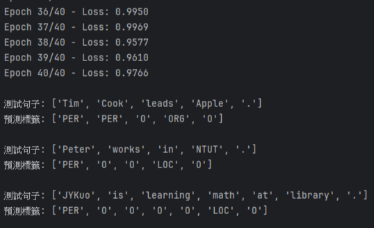

# NLP HW2 Word embedding


## 工作分配
- 111590002 鄭重雨 [50%]
  - Task1 模型尋找。
  - Task3 `Analogy Prediction` 撰寫。
  - Task4 `Compare with other document similarity estimation methods` 撰寫。
- 111590004 張意昌  [50%]
  - Task1 模型尋找。
  - Task2 `word similarity estimation` 撰寫。
  - Task5 `Apply word embeddings in other tasks` 撰寫。

## Model

> 已經嵌入在程式碼內，按照順序執行即可載入模型。

## Instruction to Execute code

> [!NOTE]  
> 以 `word_embedding.ipynb` 進行處理。 
> 你可能需要 `jupyter` 。  
> 執行順序為由上至下執行，確保程式都可以成功執行。

## Task

- Task1: 找模型。  
- Task2: 對 `word353` 進行相似度估計。  
- Task3: 對 `BATS` 進行 `Analogy Prediction` 。  
- Task4: 跟其他模型進行相似度測量比較。 [addtional]  
- Task5: `Word Embeddings` 的應用。  [addtional]  


## Task1

```
這裡我們選擇 GloVe（Global Vectors for Word Representation) 模型進行處理。
你可以不用下載模型，直接執行程式就會下載到本地資料夾。
```

## Task2

```
在這裡我們會使用 word353 內的資料去做相似度預測。
裡面有一個 combined.csv 代表兩個詞的相似程度，由人工去評分。
我們在這個任務的目的是透過我們的模型去比對兩單詞的相似度，然後再與人工分數比較。
由於模型預測的範圍在 -1~1 之間，所以我們會將結果 *5 再 +5 ，讓它的範圍變成 0~10。
之後再跟人工的分數去計算差值，差值包含以下統計結果：
絕對誤差的平均、標準差、最大最小值、Spearman 相關係數（排序相關性）、Pearson 相關係數（線性相關性）
```



## Task3

```
在這裡我們會使用 BATS 內的資料去做相似度預測。
裡面有四個資料夾，每個資料夾有十個檔案，代表哪些詞對可以做類比 (首都，國家) 。
方法是 (w1,w2) 做 (w3 :: ??) 的比對，然後去計算準確度。
會將整個 BATS 資料集預測一遍，得到結果。
```



## Task4

```
在這裡我們會使用 word353 內的資料去做相似度預測。
我們在這個任務的目的是透過我們的模型去比對兩單詞的相似度，然後再與人工分數比較。
除此之外，除了 GloVe 模型，我們也會拿 BERT model 比較。
並且比對兩兩模型與人工分數的相關性，去對比差異。
```



## Task5

```
這份小型NER任務示範了
如何自動生成NER訓練資料
如何用預訓練GloVe詞向量提升小資料集性能
如何用簡單的 BiLSTM 模型進行序列標註（NER）

我們的分類如下
人名 (PER) ➔ 如 Steve Jobs、Elon Musk
組織名 (ORG) ➔ 如 Apple、Google
地點名 (LOC) ➔ 如 California、library、school

你會看到兩份程式，一份是生成資料
另一份是生成 NER 的模型預估
並且會給出預測結果
由於我們會提供我們簡易的分類檔案，所以第一份程式碼你可以不用測試
或是讓它重新生成一份資料檔案，再執行 NER 的預測
```

